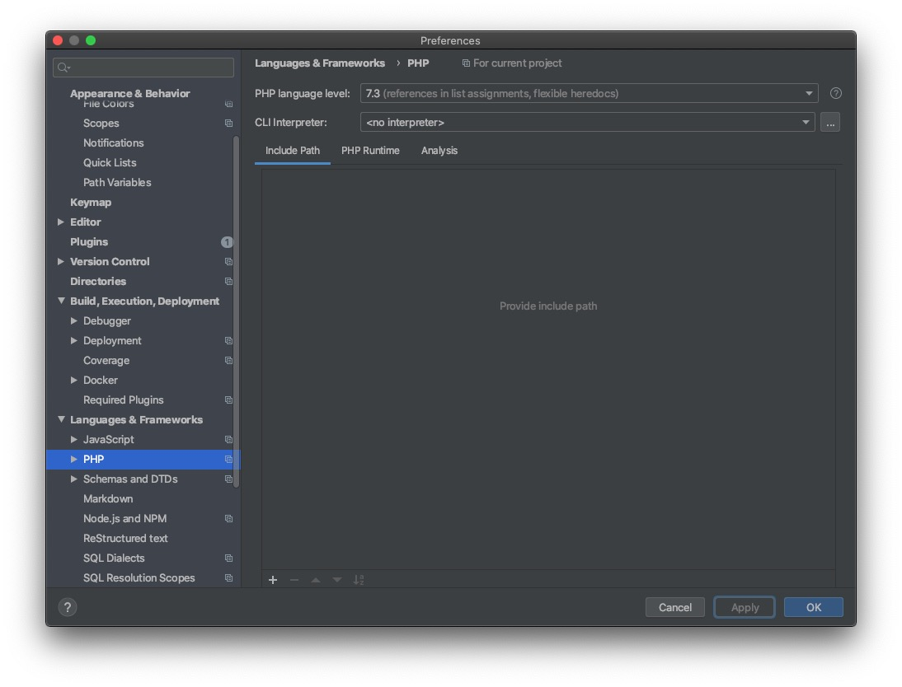
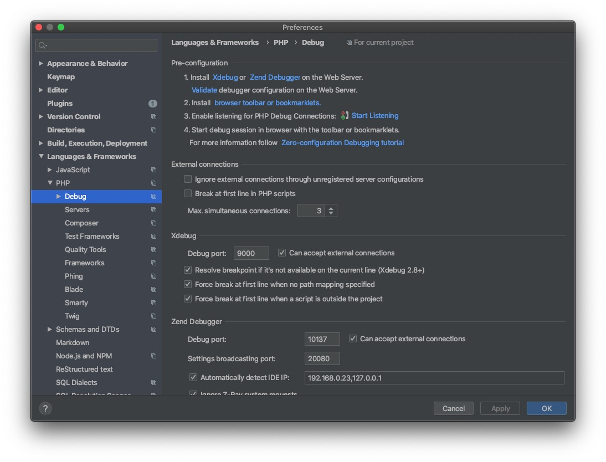
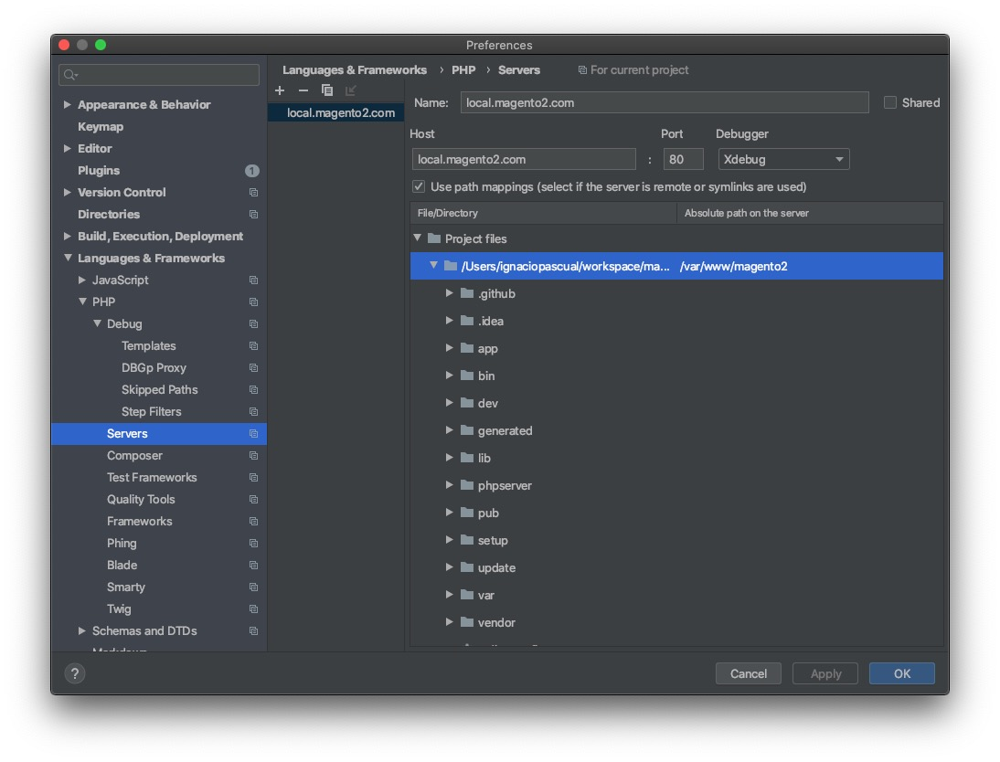

# Talos Magento Docker / Community Development

The intention of this docker is to have a workable DevBox for local development, simplified and useful for our company development.

This is useful for community Magento projects, in case of Commerce license please use Magento Cloud instances.

Previous relelases: Check other branches for 5.6, 7.0, 7.1 and 7.2

# Docker recommended settings
* CPUs 6
* Memory 8Gb 
* Swap 1Gb

# Setup local machine (Mac)

1. Setup Mac with PHP
```
xcode-select --install
```

2. Brew
```
/usr/bin/ruby -e "$(curl -fsSL https://raw.githubusercontent.com/Homebrew/install/master/install)"
```

3. PHP
```
brew install php@7.3
brew install composer
```

4. Override preference of PHP
```
brew link php@7.3
# follow instructions
```


5. Increase memory allocation
```
vi /usr/local/etc/php/7.3/php.ini
memory_limit = 2048M
```

6. Mutagen
```
brew install havoc-io/mutagen/mutagen
```

# Setup my first project

1. Download latest version (community)
```
composer create-project --repository-url=https://repo.magento.com/ magento/project-community-edition magento2
```

2. Get your Magento credentials from magento.com and use them here

3. Sample data (optional)
```
# use previous magento credentials
./magento2/bin/magento sampledata:deploy
```


4. Copy mutagen.sh and docker-compose.yml to your project
```
curl https://raw.githubusercontent.com/talosdigital/magento2devbox-web/master/docker-compose.yml > ./magento2/docker-compose.yml 
curl https://raw.githubusercontent.com/talosdigital/magento2devbox-web/master/mutagen.sh > ./magento2/mutagen.sh
```

5. Modify keys for your project
```
cd magento2
vi docker-compose.yml

# replace container name `talosdevbox` with `YOUR_PROJECT_CODENAME`
```

6. Start docker instances
Make sure you have 80, 3360, 4022 and 9000 available in your computer.
```
docker-compose up -d
```

7. Start Mutagen
```
bash mutagen.sh
# for monitoring, use: `mutagen sync monitor`
```

8. Add a domain to your local environment
```
sudo vi /etc/hosts
127.0.0.1 local.magento2.com
```

# XDebug







# Useful commands

*Magento 2.4 terminal installation*
```
./bin/magento setup:install --base-url=http://local.vista.com/ --db-host=db --db-name=magento2 --db-user=root --db-password=root --admin-firstname=Ignacio --admin-lastname=Pascual --admin-email=ignacio@example.com --admin-user=ipascual --admin-password=Test4echo --language=en_US --currency=USD --timezone=America/Chicago --use-rewrites=1 --elasticsearch-host=elastic
```

*Alias*
```
alias mysqldocker='mysql -h 127.0.0.1 -uroot -proot'
alias sshdocker='ssh -p 4022 -o UserKnownHostsFile=/dev/null -o StrictHostKeyChecking=no -t magento2@localhost "cd /var/www/magento2; bash"'
```

*Magento Bin*
```
sshdocker
./bin/magento cache:flush
```

*Docker*
```
docker ps
docker ps -a
docker images
docker-compose up -d
docker-compose stop
```

*Mutagen commands*
```
mutagen sync list
mutagen sync monitor
mutagen terminate --all
```
